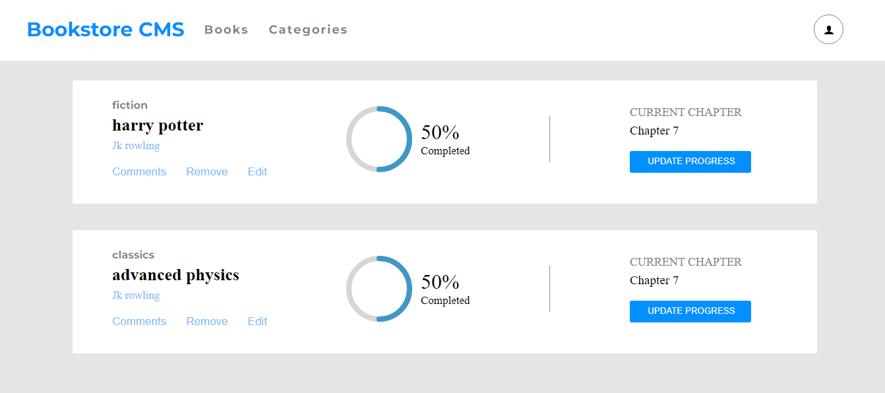

# Calculator

This is a wesbite where you can do all basic calcualtions.

This project is calculator.

## Built With
- Javascript
- HTML
- CSS
- react js

## Live Demo
[heroku](https://math-magicians42.herokuapp.com/)

[Netfliy](https://priceless-volhard-9289d9.netlify.app/)

## Getting Started
To get the content of this project locally you need to run this command in your terminal:
- git clone your `https://github.com/mugishasam123/Math-magicians.git`
- cd project Math-magicians

### `npm start`

Runs the app in the development mode.\
Open [http://localhost:3000](http://localhost:3000) to view it in your browser.

The page will reload when you make changes.\
You may also see any lint errors in the console.

### `npm test`

Launches the test runner in the interactive watch mode.\
See the section about [running tests](https://facebook.github.io/create-react-app/docs/running-tests) for more information.

### `npm run build`

Builds the app for production to the `build` folder.\
It correctly bundles React in production mode and optimizes the build for the best performance.

The build is minified and the filenames include the hashes.\
Your app is ready to be deployed!

## Authors

👤 **Mugisha Samuel**

- GitHub: [@mugishasamuel](https://github.com/mugishasam123)
- Twitter: [@mugishasamuel](https://twitter.com/mugishasamuel42/)
- LinkedIn: [mugishasamuel](https://www.linkedin.com/in/mugisha-samuel-55a905208/)
## 📝 License

This project is [MIT](./MIT.md) licensed.
